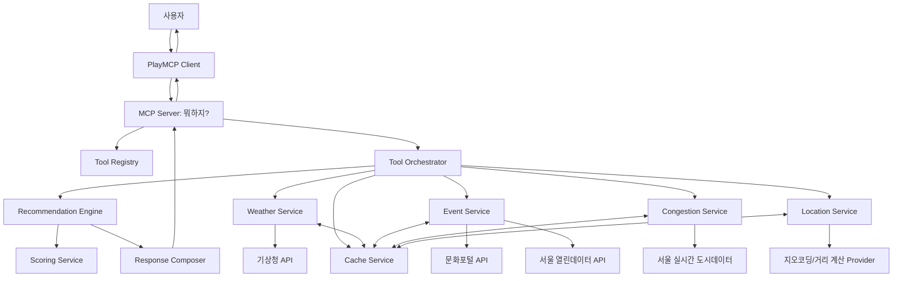

# 뭐하지?

서울의 날씨, 불쾌지수, 거리, 무료 여부, 혼잡도를 종합해 “오늘 뭐하지?”, “내일 뭐하지?”, “이번 주말 뭐하지?”에 답하는 PlayMCP MCP Server입니다.

## 1. Project Overview

**뭐하지?**는 서울 시민과 서울 방문객을 위한 Agentic AI 활동 추천 서비스입니다. 사용자가 짧은 자연어 질문을 입력하면 MCP Server가 공공 API와 내부 추천 엔진을 활용해 지금 또는 가까운 미래에 실행 가능한 활동을 추천합니다.

이 프로젝트는 일반적인 장소 검색 서비스가 아니라 **상황 기반 의사결정 Agent**입니다.

핵심 사용자 질문:

- 오늘 뭐하지?
- 내일 뭐하지?
- 이번 주말 뭐하지?

핵심 추천 기준:

1. 날씨 / 불쾌지수
2. 거리
3. 무료 여부
4. 혼잡도

추천 결과는 단순 장소 목록이 아니라 다음 정보를 포함합니다.

- 추천 장소와 활동
- 추천 이유
- 날씨 적합도
- 거리 또는 예상 이동 시간
- 무료 여부
- 혼잡도
- 데이터 출처
- 누락 데이터 또는 warning

## 2. Problem Statement

사람들은 여가 활동을 결정할 때 여러 앱과 사이트를 오가야 합니다.

- 날씨 앱에서 기온과 비 예보 확인
- 지도 앱에서 거리와 이동 시간 확인
- 행사 사이트에서 문화행사 검색
- 공공 데이터에서 무료 여부 확인
- 실시간 도시데이터에서 혼잡도 확인
- 동행자와 공유할 메시지 정리

하지만 사용자가 실제로 원하는 것은 정보 자체가 아니라 **“그래서 지금 어디 가면 좋은가?”**에 대한 답입니다.

기존 서비스의 한계:

- 장소 검색은 많지만 현재 날씨와 불쾌지수를 반영하지 않음
- 행사 검색은 많지만 즉시 방문 가능성과 이동 거리 판단이 약함
- 지도 서비스는 위치 정보는 강하지만 무료 행사와 공공 문화 활동 추천이 약함
- 일반 AI 챗봇은 실시간 데이터 근거가 부족하면 신뢰하기 어려움

뭐하지?는 이 문제를 MCP Tool 기반으로 해결합니다. Agent가 공공 API를 호출하고, 후보를 정규화하고, 점수를 계산하고, 이유를 설명합니다.

## 3. Key Features

### 자연어 기반 활동 추천

사용자는 복잡한 조건을 설정하지 않고 한 문장만 입력합니다.

예시:

```text
오늘 뭐하지?
내일 아이랑 뭐하지?
이번 주말 무료 데이트 코스 추천해줘.
비 오면 실내만 추천해줘.
```

### 날씨와 불쾌지수 반영

기상청 데이터를 기반으로 기온, 습도, 강수 확률을 분석하고 불쾌지수를 계산합니다.

폭염, 높은 습도, 비 예보가 있으면 실내 활동을 우선 추천합니다.

### 거리 기반 추천

오늘 추천은 가까운 거리와 즉시성을 강하게 반영합니다.

내일 추천은 하루 계획에 적합한 중간 거리까지 허용합니다.

주말 추천은 서울 전역으로 탐색 범위를 넓힐 수 있습니다.

### 무료 여부 반영

무료 전시, 공공 프로그램, 문화행사 등 비용 부담이 적은 활동을 우선 추천할 수 있습니다.

가격 정보가 없으면 무료로 간주하지 않습니다.

### 혼잡도 반영

서울 실시간 도시데이터를 활용해 주요 장소의 혼잡도를 반영합니다.

혼잡도 정보가 없거나 근사 매핑인 경우 confidence와 warning을 제공합니다.

### 설명 가능한 추천

모든 추천에는 이유가 포함됩니다.

예시:

```text
현재 불쾌지수가 높아 실내 활동을 우선했습니다.
이 장소는 무료이며 대중교통으로 약 30분 거리입니다.
혼잡도는 보통으로 확인되어 오늘 방문하기 적합합니다.
```

### 장애 허용 응답

외부 API 일부가 실패해도 전체 요청을 실패시키지 않습니다.

예시:

```text
혼잡도 정보는 현재 확인하지 못했습니다.
대신 날씨, 거리, 무료 여부를 기준으로 추천했습니다.
```

## 4. MCP Tools

본 프로젝트는 PlayMCP에서 사용할 수 있는 MCP Server입니다.

MVP public tool은 세 개입니다.

### `today_what_to_do`

오늘 바로 실행 가능한 활동을 추천합니다.

우선순위:

1. 거리
2. 날씨
3. 혼잡도
4. 무료 여부

주요 특징:

- 현재 시각 이후 이용 가능한 후보만 추천
- 예약 필수 후보 감점
- 곧 종료되는 후보 감점
- 폭염/비 예보 시 실내 후보 우선

예시 입력:

```json
{
  "query": "오늘 뭐하지?",
  "location": {
    "district": "송파구"
  },
  "companions": "solo",
  "preferences": {
    "free_preferred": true,
    "low_crowd_preferred": true,
    "transport_mode": "public_transit"
  },
  "result_limit": 3
}
```

### `tomorrow_what_to_do`

내일 하루 또는 반나절 계획에 적합한 활동을 추천합니다.

우선순위:

1. 날씨 예보
2. 거리
3. 혼잡도
4. 무료 여부

주요 특징:

- 내일 날짜에 유효한 행사만 추천
- 시간대별 예보 반영
- 운영 시간과 예약 위험 반영
- 가족/커플/혼자 활동 맥락 반영 가능

예시 입력:

```json
{
  "query": "내일 아이랑 뭐하지?",
  "location": {
    "district": "마포구"
  },
  "companions": "family",
  "preferred_time_of_day": "afternoon",
  "preferences": {
    "family_friendly": true,
    "indoor_preferred": true,
    "free_preferred": true
  },
  "result_limit": 3
}
```

### `weekend_what_to_do`

이번 주말 활동을 추천합니다.

우선순위:

1. 주말 날씨 예보
2. 무료 여부
3. 거리
4. 혼잡도

주요 특징:

- 다가오는 토요일/일요일 계산
- 서울 전역 후보 탐색
- 무료 또는 저비용 행사 우선
- 토/일 중 더 나은 날짜 제안 가능
- 비 또는 폭염 위험 시 플랜 B 추천 가능

예시 입력:

```json
{
  "query": "이번 주말 무료 데이트 뭐하지?",
  "location": {
    "district": "성동구"
  },
  "companions": "couple",
  "preferences": {
    "free_preferred": true,
    "date_friendly": true,
    "low_crowd_preferred": true
  },
  "result_limit": 5
}
```

## 5. Architecture Overview



### 내부 서비스

- **Weather Service**: 기상청 API 연동, 불쾌지수 계산, 실내/실외 적합도 판단
- **Event Service**: 서울 열린데이터와 문화포털 행사 데이터 조회 및 정규화
- **Congestion Service**: 서울 실시간 도시데이터 기반 혼잡도 조회와 점수화
- **Location Service**: 위치 정규화, 자치구 중심점, 거리 계산, 기상청 격자 변환
- **Recommendation Service**: 전체 추천 pipeline 오케스트레이션
- **Scoring Service**: 날씨, 거리, 무료 여부, 혼잡도 기반 점수 계산
- **Cache Service**: API 응답 캐시, stale fallback, TTL 관리

### 추천 점수 공식

오늘:

```text
today_score =
  weather_score * 0.25
+ distance_score * 0.30
+ free_score * 0.15
+ congestion_score * 0.20
+ time_fit_score * 0.10
- penalties
```

내일:

```text
tomorrow_score =
  weather_score * 0.35
+ distance_score * 0.20
+ free_score * 0.15
+ congestion_score * 0.15
+ time_fit_score * 0.15
- penalties
```

주말:

```text
weekend_score =
  weather_score * 0.35
+ distance_score * 0.15
+ free_score * 0.25
+ congestion_score * 0.15
+ time_fit_score * 0.10
- penalties
```

## 6. Installation

### Requirements

- Node.js 22 LTS
- npm
- Docker
- Redis optional

### Clone

```bash
git clone <repository-url>
cd whatdowedo
```

### Install Dependencies

```bash
npm install
```

### Build

```bash
npm run build
```

### Test

```bash
npm test
```

## 7. Environment Variables

`.env.example`을 참고하여 환경 변수를 설정합니다.

```text
NODE_ENV=development
PORT=3000
LOG_LEVEL=info

CACHE_BACKEND=memory
REDIS_URL=

KMA_BASE_URL=
KMA_SERVICE_KEY=

SEOUL_OPEN_DATA_BASE_URL=
SEOUL_OPEN_DATA_API_KEY=

SEOUL_CITY_DATA_BASE_URL=
SEOUL_CITY_DATA_API_KEY=

CULTURE_PORTAL_BASE_URL=
CULTURE_PORTAL_SERVICE_KEY=

MOCK_PROVIDERS=true
```

### 주요 환경 변수

| Variable | Description | Required |
|---|---|---|
| `NODE_ENV` | 실행 환경 | Yes |
| `PORT` | 서버 포트 | Yes |
| `LOG_LEVEL` | 로그 레벨 | Yes |
| `CACHE_BACKEND` | `memory` 또는 `redis` | Yes |
| `REDIS_URL` | Redis 연결 URL | Production에서 권장 |
| `KMA_SERVICE_KEY` | 기상청 API Key | Production Yes |
| `SEOUL_OPEN_DATA_API_KEY` | 서울 열린데이터 API Key | Production Yes |
| `SEOUL_CITY_DATA_API_KEY` | 서울 실시간 도시데이터 API Key | Production Yes |
| `CULTURE_PORTAL_SERVICE_KEY` | 문화포털 API Key | Optional |
| `MOCK_PROVIDERS` | 로컬 mock provider 사용 여부 | Local Optional |

API Key는 절대 repository에 커밋하지 않습니다.

## 8. Local Development

### 개발 서버 실행

```bash
npm run dev
```

### Mock Provider 모드

외부 API Key 없이 로컬에서 개발하려면 mock provider를 사용할 수 있습니다.

```text
MOCK_PROVIDERS=true
CACHE_BACKEND=memory
```

Mock mode에서는 fixture 데이터를 기반으로 다음 시나리오를 테스트할 수 있습니다.

- 폭염 상황의 오늘 추천
- 비 예보가 있는 내일 추천
- 무료 데이트 주말 추천
- 혼잡도 API 실패 partial success

### 테스트 실행

```bash
npm test
```

### 타입 체크

```bash
npm run typecheck
```

### 빌드 검증

```bash
npm run build
```

## 9. Deployment to PlayMCP in KC

본 프로젝트는 PlayMCP in KC의 Git Source Build Deployment를 기준으로 배포합니다.

### Docker Build

```bash
docker build -t whatdowedo-mcp .
```

### Docker Run

```bash
docker run --env-file .env -p 3000:3000 whatdowedo-mcp
```

### PlayMCP 배포 절차

1. GitHub repository를 준비합니다.
2. PlayMCP in KC에서 Git Source Build Deployment를 선택합니다.
3. repository를 연결합니다.
4. 환경 변수를 등록합니다.
5. build command와 start command를 확인합니다.
6. 배포 후 MCP Tool discovery를 확인합니다.
7. 세 public Tool을 각각 smoke test합니다.

### 배포 검증 항목

- MCP Server가 정상 시작됨
- `today_what_to_do` discover 가능
- `tomorrow_what_to_do` discover 가능
- `weekend_what_to_do` discover 가능
- API Key가 로그에 노출되지 않음
- 최소 하나 이상의 추천 응답 또는 정상 fallback 응답 반환

## 10. Example User Flows

### Flow 1. 오늘 뭐하지?

사용자:

```text
오늘 뭐하지?
```

Agent 동작:

1. 현재 위치 또는 자치구 확인
2. 현재 날씨 조회
3. 불쾌지수 계산
4. 오늘 이용 가능한 행사/시설 조회
5. 거리와 혼잡도 계산
6. 추천 점수 계산
7. 상위 3개 추천 반환

예상 응답:

```text
현재 송파구 기준 기온이 높고 불쾌지수가 높아 실내 활동을 우선했습니다.

1. 실내 무료 전시
2. 공공도서관 문화 프로그램
3. 박물관 기획전
```

### Flow 2. 내일 아이랑 뭐하지?

사용자:

```text
내일 아이랑 뭐하지?
```

Agent 동작:

1. 내일 날짜 계산
2. 시간대별 날씨 예보 확인
3. 가족 친화 후보 검색
4. 실내/무료/공공 프로그램 우선 추천
5. 이동 시간과 예약 위험 반영

예상 응답:

```text
내일 오후에는 비 가능성이 있어 실내 가족 활동을 우선 추천합니다.

1. 어린이 박물관 프로그램
2. 공공도서관 체험 수업
3. 실내 과학 전시
```

### Flow 3. 이번 주말 무료 데이트 뭐하지?

사용자:

```text
이번 주말 무료 데이트 뭐하지?
```

Agent 동작:

1. 다가오는 토/일 계산
2. 토요일과 일요일 날씨 비교
3. 서울 전역 무료 행사 검색
4. 데이트 적합 후보 필터링
5. 혼잡도 높은 장소 감점
6. 필요 시 실내 Plan B 포함

예상 응답:

```text
이번 주말은 토요일 오후가 더 쾌적합니다.
무료 데이트로는 실내 전시와 문화행사를 우선 추천합니다.

1. 무료 기획 전시
2. 문화공간 팝업 행사
3. 야외 마켓
```

### Flow 4. API 장애 상황

혼잡도 API가 실패한 경우:

```text
혼잡도 정보는 현재 확인하지 못했습니다.
대신 날씨, 거리, 무료 여부를 기준으로 추천했습니다.
```

서비스는 가능한 경우 `partial_success`로 응답합니다.

## 11. Future Roadmap

### Kakao Sharing

추천 결과를 카카오톡 공유 메시지로 변환합니다.

예정 Tool:

```text
create_share_card
```

### Calendar Integration

추천 활동을 일정으로 저장할 수 있도록 ICS 또는 Google Calendar 링크를 생성합니다.

예정 Tool:

```text
create_activity_calendar_event
```

### User Preferences

사용자 동의 기반으로 다음 선호를 저장합니다.

- 선호 자치구
- 예산 범위
- 이동수단
- 혼잡도 민감도
- 실내/실외 선호
- 방문한 장소

### Personalized Recommendations

사용자 선호와 과거 선택을 반영해 개인화 점수를 추가합니다.

단, 날씨 위험이나 운영 종료 같은 안전 요소는 개인화보다 우선합니다.

### Push Notifications

저장된 일정에 대해 날씨 변화, 혼잡도 증가, 행사 취소를 감지하고 사용자에게 알려줍니다.

### Plan B Auto Recommendation

비, 폭염, 혼잡도 증가 등 리스크가 발생하면 자동으로 대체 활동을 추천합니다.

### Regional Expansion

서울에서 시작해 수도권, 전국 지자체 열린데이터, 한국관광공사 API로 확장합니다.

## Documentation

프로젝트의 상세 문서는 다음 파일을 참고합니다.

- `PRD.md`: 제품 요구사항
- `customer.md`: 사용자 이해와 페르소나
- `architecture.md`: 시스템 아키텍처
- `tasks.md`: 구현 작업 목록
- `AGENTS.md`: AI coding agent 작업 헌장
