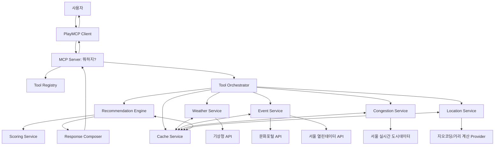
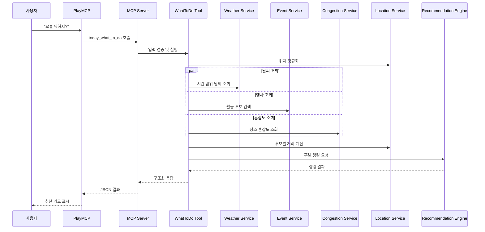
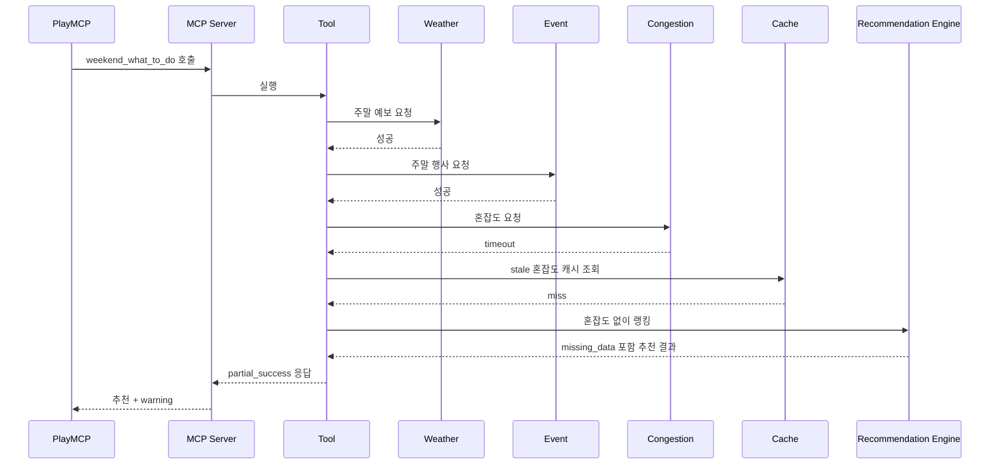
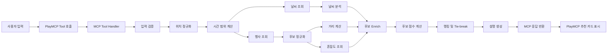
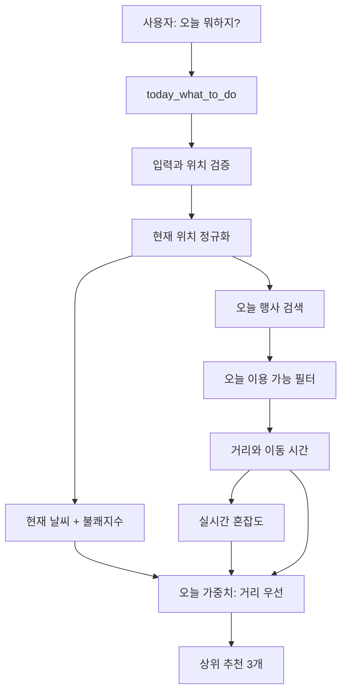
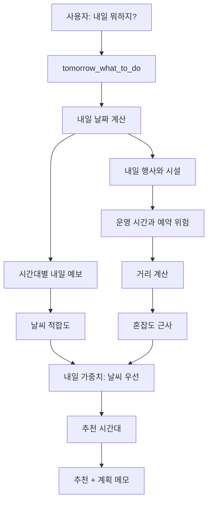
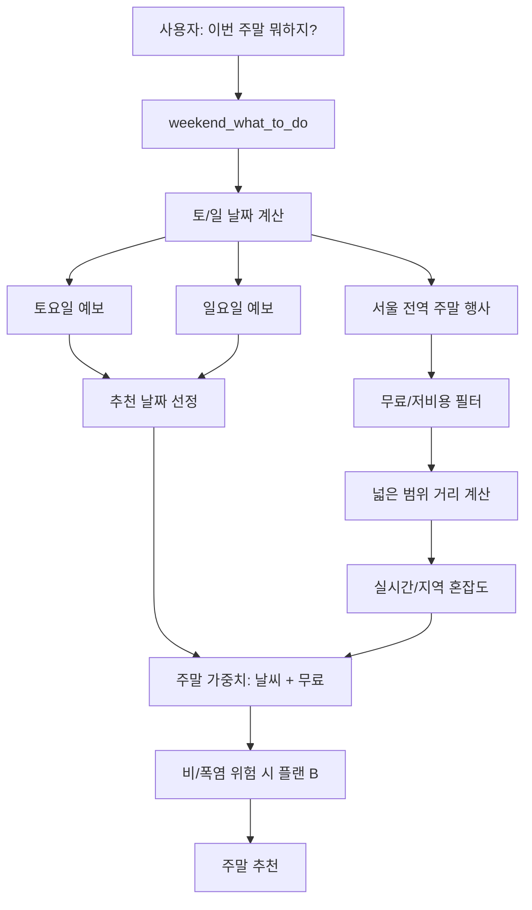
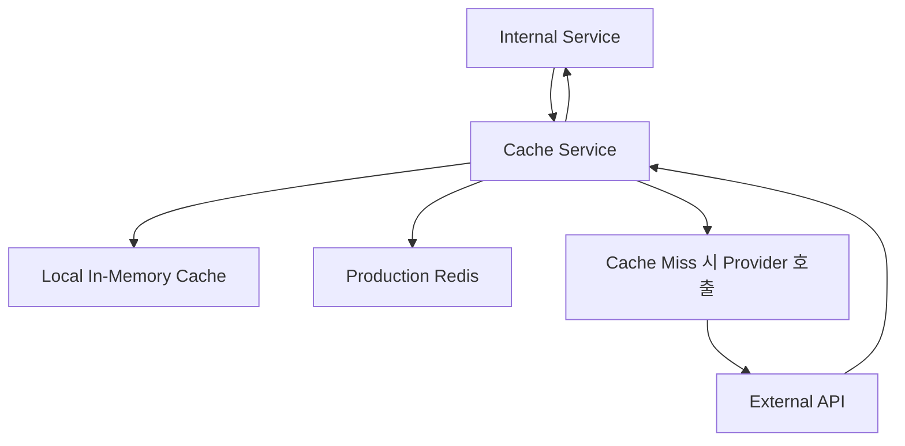
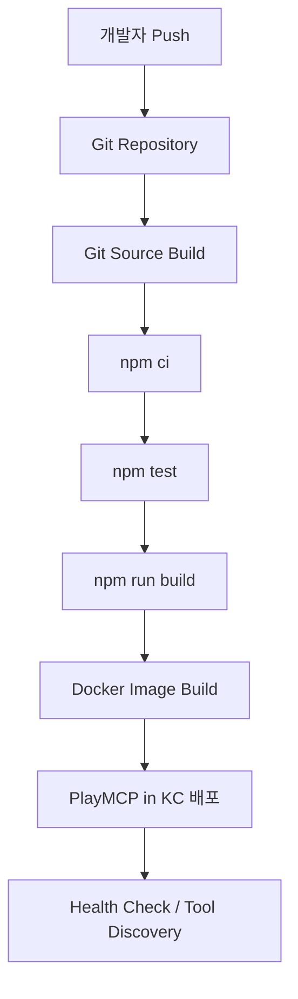
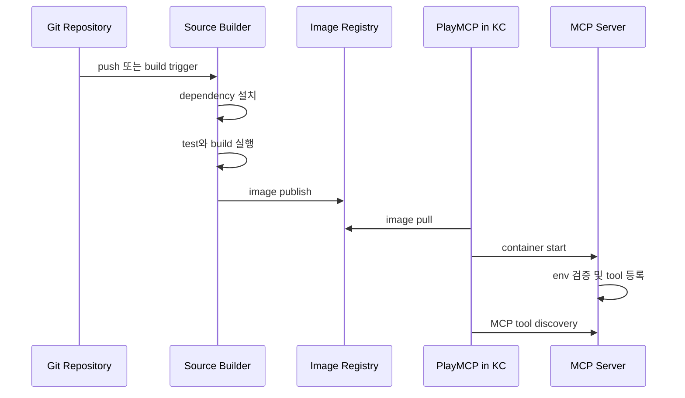

# 1. 시스템 개요

## 비즈니스 목적

**뭐하지?**는 서울 시민과 서울 방문객이 “오늘 뭐하지?”, “내일 뭐하지?”, “이번 주말 뭐하지?”라는 짧은 질문만으로 지금 실행 가능한 활동과 장소를 추천받을 수 있게 하는 **MCP Server 기반 Agentic AI 추천 서비스**이다.

이 서비스의 핵심은 장소 검색이 아니라 **상황 기반 의사결정 지원**이다. 사용자는 실제로 장소를 고를 때 날씨, 불쾌지수, 거리, 무료 여부, 혼잡도, 현재 시간, 동행자, 교통수단을 함께 고려한다. 기존 서비스는 이 요소들을 각각 따로 확인하게 만들지만, 뭐하지?는 MCP 도구가 외부 공공 API와 내부 추천 엔진을 호출하여 사용자가 바로 행동할 수 있는 선택지를 제공한다.

서비스는 PlayMCP 환경에서 동작하는 MCP Server로 구현한다. PlayMCP 또는 MCP 호환 클라이언트는 이 서버의 도구를 발견하고 호출한다. 클라이언트는 기상청, 서울 열린데이터, 서울 실시간 도시데이터, 문화포털 API를 직접 호출하지 않는다. 모든 데이터 수집, 정규화, 점수 계산, 랭킹, 오류 처리, 부분 응답 구성은 MCP Server 내부에서 수행한다.

## 아키텍처 목표

1. **MCP 중심 설계**
   - 본 프로젝트의 핵심 제품 단위는 REST API가 아니라 MCP Tool이다.
   - 외부에 노출되는 주요 도구는 `today_what_to_do`, `tomorrow_what_to_do`, `weekend_what_to_do`이다.

2. **구현 가능한 경계 정의**
   - Weather Service, Event Service, Congestion Service, Location Service, Recommendation Service, Scoring Service, Cache Service를 명확히 분리한다.
   - 각 서비스는 입력, 출력, 의존성을 명확히 갖는다.

3. **설명 가능한 추천**
   - 추천 점수와 이유는 코드 기반으로 계산한다.
   - LLM 또는 Agent는 추천 근거를 임의로 생성하지 않고, 점수 계산 결과와 reason code를 기반으로 설명한다.

4. **장애 허용성**
   - 공공 API는 느리거나 실패할 수 있다.
   - 하나의 API 실패가 전체 추천 실패로 이어지지 않도록 부분 성공 응답과 fallback을 제공한다.

5. **대화형 응답 속도**
   - PlayMCP에서 사용자가 기다릴 수 있는 시간 안에 응답해야 한다.
   - 캐시와 병렬 호출을 적극 활용한다.

6. **위치 개인정보 보호**
   - 정확한 좌표는 요청 처리 중에만 사용한다.
   - 로그에는 좌표 원문 대신 자치구 또는 해시값만 남긴다.

7. **미래 확장성**
   - 카카오 공유, 캘린더 연동, 사용자 선호 저장, 개인화 추천, 푸시 알림, 플랜 B 자동 추천을 위한 확장 지점을 남긴다.

## 설계 원칙

### Tool Contract 우선

외부 데이터 조회나 결정적 계산이 필요한 기능은 모두 명시적인 Tool 또는 내부 서비스 계약으로 구현한다. 프롬프트 안에 비즈니스 로직을 숨기지 않는다. 불쾌지수 계산, 거리 점수, 무료 여부 점수, 혼잡도 점수는 코드로 구현한다.

### 적은 수의 고수준 도구

사용자와 Agent가 직접 호출하는 MCP Tool은 적어야 한다. 날씨 조회, 행사 검색, 혼잡도 조회 같은 저수준 기능은 내부 서비스로 유지하고, 외부 MCP Tool은 사용자의 의도 단위로 제공한다.

### 데이터 기반 설명

모든 추천에는 다음 정보가 포함되어야 한다.

- 최종 점수
- 순위
- 점수 구성 요소
- reason code
- 추천 이유
- 사용된 데이터 출처
- 데이터 기준 시각
- 누락된 데이터
- confidence

혼잡도 정보가 없으면 “혼잡도 정보는 확인하지 못했습니다”라고 명시한다. 가격 정보가 없으면 무료로 간주하지 않는다.

### 서울 우선, 전국 확장 가능

MVP는 서울에 한정한다. 다만 추천 엔진은 서울 전용 데이터 구조에 종속되지 않아야 한다. 서울 데이터 어댑터가 반환한 후보는 내부 표준 `ActivityCandidate`로 정규화되어야 하며, 향후 다른 도시 데이터도 같은 스키마로 들어올 수 있어야 한다.

### 공공 데이터는 캐시하고 개인 데이터는 저장하지 않음

날씨, 행사, 혼잡도, 거리 계산 결과는 캐시할 수 있다. 사용자의 정확한 위치 이력이나 개인 선호는 MVP에서 저장하지 않는다.

---

# 2. 상위 수준 아키텍처

## 아키텍처 다이어그램



## 런타임 구성 요소

### 사용자

사용자는 짧은 자연어 요청과 선택적 조건을 입력한다.

예시:

- “오늘 뭐하지?”
- “내일 아이랑 뭐하지?”
- “이번 주말 무료 데이트 코스 추천해줘”
- “비 오면 실내만 추천해줘”

### PlayMCP

PlayMCP는 MCP Client 역할을 한다. MCP Server의 도구를 discover하고, JSON 입력을 전달하며, 반환된 구조화 응답을 사용자에게 보여준다.

### MCP Server

MCP Server는 본 프로젝트의 핵심 실행 단위이다. Tool 등록, 입력 검증, 내부 서비스 호출, 추천 랭킹, 오류 처리, 응답 생성을 담당한다.

### Recommendation Engine

정규화된 후보 활동을 받아 점수를 계산하고 순위를 매긴다. 날씨, 거리, 무료 여부, 혼잡도, 시간 적합성, 사용자 선호, 데이터 신뢰도를 반영한다.

### External APIs

외부 API는 날씨, 행사, 공공시설, 혼잡도, 거리 데이터를 제공한다. 외부 API의 응답 형식은 Provider Adapter에서만 다루고, 내부 서비스는 정규화된 타입을 사용한다.

---

# 3. MCP 아키텍처

## MCP Server 구조

권장 디렉터리 구조:

```text
src/
  index.ts
  server/
    createMcpServer.ts
    registerTools.ts
    toolContext.ts
  tools/
    todayWhatToDo.ts
    tomorrowWhatToDo.ts
    weekendWhatToDo.ts
    schemas.ts
  services/
    weather/
      WeatherService.ts
      KmaWeatherProvider.ts
      weatherTypes.ts
    events/
      EventService.ts
      SeoulEventProvider.ts
      CulturePortalProvider.ts
      eventTypes.ts
    congestion/
      CongestionService.ts
      SeoulCityDataProvider.ts
      congestionTypes.ts
    location/
      LocationService.ts
      DistanceProvider.ts
      locationTypes.ts
    recommendation/
      RecommendationService.ts
      RecommendationEngine.ts
      ResponseComposer.ts
      recommendationTypes.ts
    scoring/
      ScoringService.ts
      scoringRules.ts
    cache/
      CacheService.ts
      InMemoryCache.ts
      RedisCache.ts
  config/
    env.ts
    constants.ts
  errors/
    AppError.ts
    errorCodes.ts
  observability/
    logger.ts
    metrics.ts
    tracing.ts
  utils/
    dates.ts
    geo.ts
    validation.ts
```

## Tool 등록

MCP Server 시작 시점에 모든 Tool을 등록한다. 각 Tool은 다음 정보를 가져야 한다.

- Tool 이름
- Tool 설명
- 입력 스키마
- 출력 계약
- handler 함수
- timeout 정책
- 오류 매핑 정책

등록 예시:

```ts
server.tool(
  "today_what_to_do",
  "현재 위치, 날씨, 거리, 무료 여부, 혼잡도를 고려해 오늘 바로 할 수 있는 활동을 추천합니다.",
  TodayWhatToDoInputSchema,
  async (input, context) => {
    return todayWhatToDoTool.execute(input, context);
  }
);
```

Tool 이름은 외부 계약이므로 임의 변경하면 안 된다. 변경이 필요하면 버전이 붙은 새 Tool을 추가한다.

## Tool 실행 생명주기

1. **요청 수신**
   - PlayMCP가 Tool 이름과 JSON 입력을 MCP Server에 전달한다.

2. **입력 검증**
   - 필수 값, enum, 좌표 범위, 예산 범위, result limit을 검증한다.

3. **컨텍스트 정규화**
   - 자연어 조건을 내부 필드로 변환한다.
   - intent별 시간 범위를 계산한다.
   - 위치 입력을 좌표 또는 자치구 중심점으로 변환한다.

4. **캐시 조회**
   - 날씨, 행사, 혼잡도, 거리, 추천 결과 캐시를 조회한다.

5. **병렬 데이터 수집**
   - 가능한 경우 날씨, 행사, 혼잡도 조회를 병렬 수행한다.

6. **후보 정규화**
   - 외부 API 응답을 내부 `ActivityCandidate`로 변환한다.

7. **후보 enrich**
   - 거리, 이동 시간, 날씨 적합도, 혼잡도 점수, 가격 점수를 붙인다.

8. **점수 계산 및 랭킹**
   - intent별 가중치를 적용해 점수를 계산한다.

9. **응답 구성**
   - 추천 목록, 요약, reason code, 설명, source metadata, warning을 포함한다.

10. **로그와 메트릭**
   - request id, tool name, latency, provider 상태, 추천 개수, degraded 여부를 기록한다.

11. **응답 반환**
   - 구조화 JSON을 PlayMCP에 반환한다.

## Tool Discovery

PlayMCP는 MCP Server로부터 Tool 목록을 discover한다. Tool 설명은 Agent가 올바른 도구를 고를 수 있을 만큼 명확해야 한다.

- `today_what_to_do`: 당일 또는 즉시 실행 가능한 활동 추천
- `tomorrow_what_to_do`: 다음날 계획 추천
- `weekend_what_to_do`: 다가오는 토요일/일요일 주말 계획 추천

MVP에서는 저수준 Tool을 외부에 노출하지 않는다. 디버깅용 Tool이 필요하면 별도 namespace로 추가한다.

## 정상 실행 시퀀스



## Degraded 실행 시퀀스



---

# 4. MCP Tool 설계

## 공통 스키마

### 공통 입력 필드

모든 공개 추천 Tool은 다음 공통 입력을 지원한다.

```json
{
  "query": "오늘 뭐하지?",
  "location": {
    "latitude": 37.5145,
    "longitude": 127.1059,
    "district": "송파구",
    "place_name": "잠실역"
  },
  "companions": "solo",
  "preferences": {
    "indoor_preferred": false,
    "outdoor_preferred": false,
    "free_preferred": true,
    "low_crowd_preferred": true,
    "family_friendly": false,
    "date_friendly": false,
    "tourist_friendly": false,
    "max_budget_krw": 10000,
    "max_travel_minutes": 45,
    "transport_mode": "public_transit"
  },
  "language": "ko",
  "result_limit": 5
}
```

### 공통 추천 출력 객체

```json
{
  "id": "activity_001",
  "rank": 1,
  "title": "서울역사박물관 무료 전시",
  "category": "exhibition",
  "venue": "서울역사박물관",
  "district": "종로구",
  "address": "서울특별시 종로구 새문안로 55",
  "latitude": 37.5704,
  "longitude": 126.9707,
  "is_indoor": true,
  "is_free": true,
  "price_text": "무료",
  "distance_km": 12.4,
  "estimated_travel_minutes": 38,
  "congestion": {
    "level": "normal",
    "score": 80,
    "confidence": "medium"
  },
  "weather_fit": {
    "score": 96,
    "reason": "높은 불쾌지수로 실내 활동에 적합"
  },
  "score": 88.7,
  "reason_codes": ["indoor", "free", "weather_fit", "reasonable_distance"],
  "explanation": "현재 불쾌지수가 높아 실내 활동을 우선했습니다. 이 전시는 무료이며 대중교통으로 약 38분 거리라 오늘 방문하기 적합합니다.",
  "source": {
    "provider": "Seoul Open Data",
    "url": "https://example.com/event",
    "fetched_at": "2026-06-19T18:00:00+09:00"
  }
}
```

### 공통 응답 Envelope

```json
{
  "status": "success",
  "intent": "today",
  "summary": {
    "location_label": "송파구",
    "time_window": {
      "start": "2026-06-19T18:00:00+09:00",
      "end": "2026-06-19T23:59:59+09:00"
    },
    "weather": {
      "temperature_c": 33,
      "humidity_percent": 70,
      "precipitation_probability": 20,
      "discomfort_index": 82.1,
      "discomfort_level": "very_high",
      "recommendation_bias": "indoor"
    }
  },
  "recommendations": [],
  "warnings": [],
  "missing_data": [],
  "metadata": {
    "request_id": "req_abc123",
    "generated_at": "2026-06-19T18:00:03+09:00",
    "data_freshness": {
      "weather": "fresh",
      "events": "cached",
      "congestion": "fresh"
    }
  }
}
```

## Tool: `today_what_to_do`

### 목적

오늘 바로 실행 가능한 활동을 추천한다. 당일 추천은 거리, 현재 날씨, 혼잡도, 무료 여부를 강하게 반영한다. 예약이 필요하거나 곧 종료되는 활동은 감점 또는 제외한다.

### 입력 스키마

```json
{
  "type": "object",
  "required": ["query"],
  "properties": {
    "query": {
      "type": "string",
      "minLength": 1,
      "maxLength": 300
    },
    "location": {
      "type": "object",
      "properties": {
        "latitude": { "type": "number", "minimum": 33, "maximum": 39 },
        "longitude": { "type": "number", "minimum": 124, "maximum": 132 },
        "district": { "type": "string" },
        "place_name": { "type": "string" }
      }
    },
    "companions": {
      "type": "string",
      "enum": ["solo", "couple", "family", "friends", "tourist", "unknown"],
      "default": "unknown"
    },
    "preferences": {
      "type": "object",
      "properties": {
        "indoor_preferred": { "type": "boolean" },
        "outdoor_preferred": { "type": "boolean" },
        "free_preferred": { "type": "boolean" },
        "low_crowd_preferred": { "type": "boolean" },
        "family_friendly": { "type": "boolean" },
        "date_friendly": { "type": "boolean" },
        "tourist_friendly": { "type": "boolean" },
        "max_budget_krw": { "type": "integer", "minimum": 0, "maximum": 300000 },
        "max_travel_minutes": { "type": "integer", "minimum": 5, "maximum": 180 },
        "transport_mode": {
          "type": "string",
          "enum": ["walking", "public_transit", "driving"],
          "default": "public_transit"
        }
      }
    },
    "language": {
      "type": "string",
      "enum": ["ko", "en"],
      "default": "ko"
    },
    "result_limit": {
      "type": "integer",
      "minimum": 1,
      "maximum": 5,
      "default": 3
    }
  }
}
```

### 출력 스키마

공통 응답 Envelope를 사용하며 `intent = "today"`이다.

추가 필드:

```json
{
  "today_constraints": {
    "requires_open_now_or_later_today": true,
    "reservation_penalty_applied": true,
    "distance_priority": "high"
  }
}
```

### 검증 규칙

- `query`는 필수이다.
- 좌표, 자치구, 장소명 중 하나 이상의 위치 단서가 있으면 위치 기반 추천을 수행한다.
- 위치가 없으면 서울 전체 추천으로 degrade하고 `LOCATION_MISSING` warning을 포함한다.
- `indoor_preferred`와 `outdoor_preferred`가 동시에 true이면 날씨 적합도가 최종 판단 기준이 된다.
- `result_limit`은 최대 5개로 제한한다.
- 오늘 추천에서는 이미 종료되었거나 현재 방문 불가능한 후보를 제외한다.

### 오류 케이스

| Error Code | 설명 | 처리 |
|---|---|---|
| `INVALID_INPUT` | 입력 스키마 검증 실패 | error envelope 반환 |
| `LOCATION_UNSUPPORTED` | 서울 외 지역 | 서울 전체 추천 또는 오류 반환 |
| `NO_CANDIDATES` | 필터링 후 후보 없음 | 카테고리 기반 fallback 추천 |
| `WEATHER_UNAVAILABLE` | 기상청 API 실패 및 캐시 없음 | 중립 날씨 점수로 계속 |
| `EVENTS_UNAVAILABLE` | 행사 API 실패 및 캐시 없음 | 공공시설 fallback 사용 |
| `CONGESTION_UNAVAILABLE` | 혼잡도 API 실패 | 중립 혼잡도 점수로 계속 |

### JSON 예시

```json
{
  "query": "오늘 뭐하지?",
  "location": {
    "latitude": 37.5145,
    "longitude": 127.1059,
    "district": "송파구"
  },
  "companions": "solo",
  "preferences": {
    "free_preferred": true,
    "low_crowd_preferred": true,
    "transport_mode": "public_transit",
    "max_travel_minutes": 45
  },
  "result_limit": 3
}
```

## Tool: `tomorrow_what_to_do`

### 목적

내일 하루 또는 반나절 계획에 적합한 활동을 추천한다. 내일 추천은 예보 기반 날씨 적합성, 시간대 적합성, 운영 시간, 거리, 무료 여부를 중요하게 반영한다.

### 입력 스키마

```json
{
  "type": "object",
  "required": ["query"],
  "properties": {
    "query": { "type": "string", "minLength": 1, "maxLength": 300 },
    "location": { "type": "object" },
    "companions": {
      "type": "string",
      "enum": ["solo", "couple", "family", "friends", "tourist", "unknown"],
      "default": "unknown"
    },
    "preferred_time_of_day": {
      "type": "string",
      "enum": ["morning", "afternoon", "evening", "any"],
      "default": "any"
    },
    "preferences": { "type": "object" },
    "language": { "type": "string", "enum": ["ko", "en"], "default": "ko" },
    "result_limit": { "type": "integer", "minimum": 1, "maximum": 5, "default": 3 }
  }
}
```

### 출력 스키마

공통 응답 Envelope를 사용하며 `intent = "tomorrow"`이다.

추가 필드:

```json
{
  "tomorrow_plan": {
    "recommended_time_of_day": "afternoon",
    "weather_risk": "low",
    "reservation_risk": "medium"
  }
}
```

### 검증 규칙

- 서버 기준 시간대는 `Asia/Seoul`이다.
- 내일 날짜에 유효한 후보만 추천한다.
- 사용자가 시간대를 지정하면 해당 시간대와 운영 시간이 겹쳐야 한다.
- 예약 필수 활동은 허용하되 점수를 낮춘다.
- 날씨 예보는 가능한 경우 시간대별로 반영한다.

### 오류 케이스

| Error Code | 설명 | 처리 |
|---|---|---|
| `FORECAST_UNAVAILABLE` | 내일 예보 조회 실패 | 캐시 또는 중립 점수 사용 |
| `NO_TIME_MATCH` | 시간대에 맞는 후보 없음 | 시간 조건 완화 후 warning |
| `NO_CANDIDATES` | 행사 후보 없음 | 공공시설 fallback |
| `LOCATION_MISSING` | 위치 없음 | 서울 전체 추천 |

## Tool: `weekend_what_to_do`

### 목적

이번 주말 활동을 추천한다. 주말 추천은 서울 전역 탐색이 가능하며, 날씨 예보, 무료 여부, 거리, 혼잡도, 발견성을 균형 있게 반영한다.

### 입력 스키마

```json
{
  "type": "object",
  "required": ["query"],
  "properties": {
    "query": { "type": "string", "minLength": 1, "maxLength": 300 },
    "location": { "type": "object" },
    "companions": {
      "type": "string",
      "enum": ["solo", "couple", "family", "friends", "tourist", "unknown"],
      "default": "unknown"
    },
    "weekend_days": {
      "type": "array",
      "items": {
        "type": "string",
        "enum": ["saturday", "sunday"]
      },
      "default": ["saturday", "sunday"]
    },
    "preferences": { "type": "object" },
    "language": { "type": "string", "enum": ["ko", "en"], "default": "ko" },
    "result_limit": { "type": "integer", "minimum": 1, "maximum": 5, "default": 5 }
  }
}
```

### 출력 스키마

공통 응답 Envelope를 사용하며 `intent = "weekend"`이다.

추가 필드:

```json
{
  "weekend_summary": {
    "best_day": "saturday",
    "saturday_weather_fit": 86,
    "sunday_weather_fit": 62,
    "plan_b_recommended": true
  }
}
```

### 검증 규칙

- `Asia/Seoul` 기준 다가오는 토요일과 일요일을 계산한다.
- 현재 날짜가 토요일이면 남은 토요일과 일요일을 포함한다.
- 위치가 없어도 서울 전체 후보로 추천할 수 있다.
- 주말 intent에서는 무료 여부 가중치가 오늘/내일보다 높다.
- 이동 허용 범위는 넓지만 과도한 이동 마찰은 감점한다.

### 오류 케이스

| Error Code | 설명 | 처리 |
|---|---|---|
| `WEEKEND_DATE_RESOLUTION_FAILED` | 주말 날짜 계산 실패 | 내부 오류 |
| `FORECAST_PARTIAL` | 한 날짜 예보만 있음 | 가능한 날짜 기준 추천 |
| `EVENTS_UNAVAILABLE` | 행사 API 실패 | 공공시설 fallback |
| `TOO_MANY_PROVIDER_FAILURES` | 다수 provider 실패 | 카테고리 기반 추천 |

---

# 5. 내부 서비스 아키텍처

## Weather Service

### 책임

- 좌표를 기상청 격자 좌표로 변환한다.
- 현재 날씨, 초단기 예보, 단기 예보를 조회한다.
- 기상청 응답을 내부 `WeatherSnapshot`으로 정규화한다.
- 불쾌지수를 계산한다.
- 실내/실외 추천 bias를 결정한다.
- 격자와 base time 기준으로 캐시한다.

### 입력

```ts
type WeatherRequest = {
  latitude?: number;
  longitude?: number;
  district?: string;
  timeWindow: {
    start: string;
    end: string;
  };
  mode: "today" | "tomorrow" | "weekend";
};
```

### 출력

```ts
type WeatherSnapshot = {
  temperatureC: number | null;
  humidityPercent: number | null;
  precipitationProbability: number | null;
  precipitationType: "none" | "rain" | "snow" | "sleet" | "unknown";
  windSpeedMs: number | null;
  skyCondition: "clear" | "cloudy" | "overcast" | "unknown";
  discomfortIndex: number | null;
  discomfortLevel: "low" | "moderate" | "high" | "very_high" | "unknown";
  recommendationBias: "indoor" | "outdoor" | "mixed";
  source: SourceMetadata;
};
```

### 의존성

- KMA Weather API
- Cache Service
- Location Service
- Date utility

## Event Service

### 책임

- 서울 열린데이터와 문화포털에서 행사 데이터를 조회한다.
- 외부 응답을 `ActivityCandidate`로 정규화한다.
- 날짜, 카테고리, 위치, 가격, 이용 가능 여부로 필터링한다.
- 중복 행사를 제거한다.
- 무료 여부를 파싱한다.
- 실내/실외 여부를 추론한다.

### 입력

```ts
type EventSearchRequest = {
  dateRange: {
    startDate: string;
    endDate: string;
  };
  district?: string;
  categories?: ActivityCategory[];
  freePreferred?: boolean;
  indoorPreferred?: boolean;
  companions?: CompanionType;
};
```

### 출력

```ts
type ActivityCandidate = {
  id: string;
  title: string;
  category: ActivityCategory;
  venue: string;
  address?: string;
  district?: string;
  latitude?: number;
  longitude?: number;
  startDate?: string;
  endDate?: string;
  startTime?: string;
  endTime?: string;
  isIndoor: boolean | null;
  isFree: boolean | null;
  priceText?: string;
  requiresReservation?: boolean | null;
  source: SourceMetadata;
};
```

### 의존성

- Seoul Open Data API
- Culture Portal API
- Cache Service
- Location Service

## Congestion Service

### 책임

- 서울 실시간 도시데이터에서 장소별 또는 지역별 혼잡도를 조회한다.
- 후보 장소를 서울 실시간 도시데이터의 지원 Area에 매핑한다.
- 혼잡도 값을 내부 score로 변환한다.
- 정확 매칭이 아닌 경우 confidence를 낮춘다.
- API 실패 시 중립 혼잡도 점수를 제공한다.

### 입력

```ts
type CongestionRequest = {
  candidates: ActivityCandidate[];
  userLocation?: GeoPoint;
};
```

### 출력

```ts
type CongestionResult = {
  candidateId: string;
  areaName?: string;
  level: "relaxed" | "normal" | "slightly_crowded" | "crowded" | "very_crowded" | "unknown";
  score: number;
  confidence: "high" | "medium" | "low";
  source?: SourceMetadata;
};
```

### 의존성

- Seoul Real-Time City Data API
- Cache Service
- Venue-to-area mapping table
- Location Service

## Location Service

### 책임

- 사용자 위치 입력을 정규화한다.
- 자치구 또는 장소명을 좌표로 변환한다.
- 사용자 위치와 후보 장소 간 거리를 계산한다.
- 이동 시간을 추정한다.
- WGS84 좌표를 기상청 격자 좌표로 변환한다.
- 위치가 서울 서비스 범위 안인지 확인한다.

### 입력

```ts
type LocationInput = {
  latitude?: number;
  longitude?: number;
  district?: string;
  placeName?: string;
};
```

### 출력

```ts
type ResolvedLocation = {
  latitude: number | null;
  longitude: number | null;
  district?: string;
  label: string;
  precision: "exact" | "district" | "city" | "unknown";
  inSupportedArea: boolean;
};
```

### 의존성

- 서울 자치구 중심점 정적 데이터
- 선택적 geocoding provider
- 선택적 routing provider
- Cache Service

## Recommendation Service

### 책임

- 전체 추천 pipeline을 조율한다.
- intent별 검색 계획을 만든다.
- Weather, Event, Congestion, Location, Scoring Service를 호출한다.
- 부분 실패와 degraded mode를 처리한다.
- 랭킹된 추천 결과와 설명을 반환한다.

### 입력

```ts
type RecommendationRequest = {
  intent: "today" | "tomorrow" | "weekend";
  query: string;
  location: LocationInput;
  companions: CompanionType;
  preferences: UserPreferences;
  resultLimit: number;
  language: "ko" | "en";
};
```

### 출력

```ts
type RecommendationResponse = {
  status: "success" | "partial_success" | "error";
  intent: string;
  summary: ResponseSummary;
  recommendations: RankedRecommendation[];
  warnings: ResponseWarning[];
  missingData: string[];
  metadata: ResponseMetadata;
};
```

### 의존성

- Weather Service
- Event Service
- Congestion Service
- Location Service
- Scoring Service
- Cache Service
- Response Composer

## Scoring Service

### 책임

- 점수 구성 요소를 계산한다.
- intent별 가중치를 적용한다.
- 예약 필요, 곧 종료, 데이터 누락, 날씨 부적합 penalty를 적용한다.
- reason code를 생성한다.
- 동점 후보를 tie-break한다.

### 입력

```ts
type ScoringInput = {
  intent: IntentType;
  candidate: EnrichedCandidate;
  weather: WeatherSnapshot;
  preferences: UserPreferences;
  now: string;
};
```

### 출력

```ts
type ScoreResult = {
  totalScore: number;
  components: {
    weather: number;
    distance: number;
    freeAdmission: number;
    congestion: number;
    timeFit: number;
    preference: number;
  };
  penalties: ScorePenalty[];
  reasonCodes: string[];
};
```

### 의존성

- scoringRules
- Date utilities
- Weather suitability helper

## Cache Service

### 책임

- typed get/set/delete API를 제공한다.
- namespace별 TTL을 지원한다.
- stale fallback을 지원한다.
- 로컬 개발에서는 in-memory cache, 운영에서는 Redis를 사용한다.
- 동일 key에 대한 중복 provider 호출을 coalescing한다.

### 입력

```ts
type CacheOptions = {
  ttlSeconds: number;
  allowStale?: boolean;
  staleTtlSeconds?: number;
};
```

### 출력

```ts
type CacheResult<T> = {
  hit: boolean;
  stale: boolean;
  value: T | null;
};
```

---

# 6. 데이터 흐름

## 전체 요청 생명주기



## 오늘 요청 흐름



## 내일 요청 흐름



## 주말 요청 흐름



---

# 7. Recommendation Engine

## 필수 랭킹 요소

Recommendation Engine은 다음 네 가지 요소를 반드시 반영한다.

1. 날씨
2. 거리
3. 무료 여부
4. 혼잡도

보조 요소:

- 시간 적합성
- 동행자 적합성
- 카테고리 다양성
- 예약 위험
- 데이터 confidence
- 데이터 freshness

## Intent별 가중치

### 오늘

오늘은 즉시성이 중요하므로 거리 가중치가 가장 높다.

```text
today_score =
  weather_score * 0.25
+ distance_score * 0.30
+ free_score * 0.15
+ congestion_score * 0.20
+ time_fit_score * 0.10
- penalties
```

### 내일

내일은 예보 기반 계획이 중요하므로 날씨 가중치가 가장 높다.

```text
tomorrow_score =
  weather_score * 0.35
+ distance_score * 0.20
+ free_score * 0.15
+ congestion_score * 0.15
+ time_fit_score * 0.15
- penalties
```

### 주말

주말은 날씨, 무료 여부, 발견성이 중요하다.

```text
weekend_score =
  weather_score * 0.35
+ distance_score * 0.15
+ free_score * 0.25
+ congestion_score * 0.15
+ time_fit_score * 0.10
- penalties
```

## 구성 점수

### 날씨 점수

```text
강수 확률 >= 60:
  실내 = 100
  실외 = 30

불쾌지수 >= 80:
  실내 = 100
  그늘 있는 실외 = 50
  일반 실외 = 20

18 <= 기온 <= 26 and 강수 확률 < 30:
  실외 = 100
  실내 = 80
```

### 거리 점수

이동 시간이 있으면 이동 시간을 우선 사용한다.

오늘:

```text
distance_score = max(0, 100 - travel_minutes * 1.4)
```

내일:

```text
distance_score = max(0, 100 - travel_minutes * 1.0)
```

주말:

```text
distance_score = max(0, 100 - travel_minutes * 0.7)
```

### 무료 여부 점수

```text
무료 = 100
1만원 이하 = 80
3만원 이하 = 50
3만원 초과 = 25
가격 정보 없음 = 40
```

사용자가 무료를 명시적으로 요청한 경우 가격 정보 없음은 무료로 취급하지 않는다.

### 혼잡도 점수

```text
여유 = 100
보통 = 80
약간 붐빔 = 55
붐빔 = 30
매우 붐빔 = 10
정보 없음 = 60
```

사용자가 낮은 혼잡도를 선호하면 다음 penalty를 적용한다.

```text
if congestion_level in ["crowded", "very_crowded"]:
  penalty += 10
```

## Penalty

```text
오늘 예약 필수 penalty = 15
비 오는 날 실외 penalty = 25
불쾌지수 높을 때 실외 penalty = 20
곧 종료 penalty = 30
위치 정보 누락 penalty = 10
무료 요청 시 가격 정보 없음 penalty = 20
혼잡도 confidence 낮음 penalty = 5
```

## 점수 계산 예시

후보: 실내 무료 전시, 38분 거리, 혼잡도 보통, 불쾌지수 매우 높음.

```text
weather_score = 100
distance_score = 100 - 38 * 1.4 = 46.8
free_score = 100
congestion_score = 80
time_fit_score = 90

today_score =
  100 * 0.25
+ 46.8 * 0.30
+ 100 * 0.15
+ 80 * 0.20
+ 90 * 0.10
= 79.04
```

후보: 야외 축제, 20분 거리, 무료, 혼잡, 불쾌지수 매우 높음.

```text
weather_score = 20
distance_score = 72
free_score = 100
congestion_score = 30
time_fit_score = 90
penalty = 20

today_score =
  20 * 0.25
+ 72 * 0.30
+ 100 * 0.15
+ 30 * 0.20
+ 90 * 0.10
- 20
= 36.6
```

더 가까운 야외 축제보다 실내 무료 전시가 더 높은 점수를 받는다. 이유는 폭염/불쾌지수와 혼잡도가 사용자 만족도에 큰 영향을 주기 때문이다.

## Tie-breaking

점수 차이가 2점 미만이면 다음 순서로 동점을 해소한다.

1. 데이터 confidence가 높은 후보
2. 날씨 적합도가 높은 후보
3. 이동 시간이 짧은 후보
4. 무료 후보
5. 혼잡도가 낮은 후보
6. 동행자 유형에 더 적합한 후보
7. 기존 추천과 카테고리가 다른 후보
8. source timestamp가 더 최신인 후보
9. candidate id 기준 deterministic sort

## 다양성 제어

상위 추천이 모두 같은 카테고리로만 구성되면 사용자에게 단조롭게 느껴진다.

규칙:

- 1위는 순수 점수 1위로 선택한다.
- 2~5위는 점수 차이가 8점 이내이면 카테고리 다양성을 반영한다.
- 단, 날씨에 부적합하거나 안전하지 않은 후보를 다양성만으로 승격하지 않는다.

---

# 8. Weather Intelligence Layer

## 날씨 분석

Weather Intelligence Layer는 원시 날씨 데이터를 추천 신호로 변환한다. 사용자는 기온과 습도 숫자 자체보다 “그래서 실내가 좋은지, 야외가 좋은지”를 알고 싶어 한다.

생성 신호:

- 현재 또는 예보 기온
- 습도
- 강수 확률
- 강수 형태
- 풍속
- 하늘 상태
- 불쾌지수
- 날씨 위험도
- 추천 bias
- 실내 적합도
- 실외 적합도

## 불쾌지수 계산

```text
DI = 0.81T + 0.01H * (0.99T - 14.3) + 46.3
```

정의:

- `T`: 섭씨 기온
- `H`: 상대습도

분류:

```text
DI < 68         = low
68 <= DI < 75   = moderate
75 <= DI < 80   = high
DI >= 80        = very_high
```

## 실내/실외 적합도

```text
indoor_suitability =
  base 70
+ rain_bonus
+ heat_bonus
+ cold_bonus
+ high_humidity_bonus

outdoor_suitability =
  base 70
+ pleasant_weather_bonus
- rain_penalty
- heat_penalty
- cold_penalty
- high_humidity_penalty
```

예시:

```text
if precipitation_probability >= 60:
  indoor += 25
  outdoor -= 45

if discomfort_index >= 80:
  indoor += 25
  outdoor -= 50

if 18 <= temperature_c <= 26 and precipitation_probability < 30:
  outdoor += 25
```

## 날씨가 추천에 미치는 영향

### 비

- 실내 전시, 박물관, 도서관, 실내 문화공간을 강하게 추천한다.
- 공원, 야외 축제, 피크닉, 장거리 도보 코스는 감점한다.
- 강수 확률 50% 이상이면 플랜 B를 함께 제공한다.

### 폭염과 높은 불쾌지수

- 에어컨이 있는 실내 활동을 우선한다.
- 지하철역과 가까운 장소를 선호한다.
- 도보 이동 시간이 긴 후보를 감점한다.

### 한파

- 실내 장소와 짧은 이동 동선을 선호한다.
- 실외 대기 시간이 긴 활동을 감점한다.

### 쾌적한 날씨

- 한강, 공원, 야외 축제, 마켓, 산책 코스를 가중한다.
- 다만 혼자 조용한 활동을 원하는 사용자에게는 실내 선택지도 유지한다.

---

# 9. 데이터 소스

## KMA Weather API

### 목적

기상청 API는 현재 날씨와 예보 데이터를 제공한다. 기온, 습도, 강수 확률, 강수 형태, 풍속을 기반으로 불쾌지수와 날씨 적합도를 계산한다.

### Endpoint

Provider Adapter는 다음 기상청 단기예보 계열 endpoint를 지원해야 한다.

- `getUltraSrtNcst`: 초단기실황
- `getUltraSrtFcst`: 초단기예보
- `getVilageFcst`: 단기예보

환경 변수:

```text
KMA_BASE_URL
KMA_SERVICE_KEY
```

### 제한사항

- 위도/경도가 아니라 기상청 격자 좌표가 필요하다.
- 예보 base time 직후에는 데이터가 아직 준비되지 않을 수 있다.
- 응답 메시지가 인코딩되어 올 수 있다.
- 주말 예보는 시간이 멀수록 정확도가 낮다.

### Retry 전략

- Timeout: 2.5초
- Retry: 1회, 300ms jitter
- 캐시 fallback: 같은 격자와 시간대의 최근 캐시 사용
- 캐시도 없으면 중립 날씨 점수와 warning 사용

## Culture Portal API

### 목적

문화포털 API는 전시, 공연, 문화행사, 프로그램 데이터를 제공한다. 서울 열린데이터의 후보를 보완하는 보조 소스이다.

### Endpoint

구체 endpoint는 Provider Adapter에 캡슐화한다.

```text
CULTURE_PORTAL_BASE_URL
CULTURE_PORTAL_SERVICE_KEY
```

Provider 메서드:

- `searchEvents(dateRange, region, category)`
- `getEventDetail(eventId)`

### 제한사항

- 카테고리 체계가 서울 열린데이터와 다를 수 있다.
- 위치 정보가 없거나 부정확할 수 있다.
- 가격/무료 여부가 자유 텍스트일 수 있다.
- 데이터 갱신 주기가 일정하지 않을 수 있다.

### Retry 전략

- Timeout: 3초
- Retry: 1회
- Cache: 6~24시간
- 실패 시 서울 열린데이터만 사용

## Seoul Open Data API

### 목적

서울 열린데이터는 서울 문화행사, 공공시설, 문화공간 데이터의 핵심 소스이다. MVP에서 가장 중요한 행사/시설 데이터 공급원이다.

### Endpoint

Provider Adapter는 다음 계열을 지원한다.

- `culturalEventInfo`
- 공공시설 및 문화공간 데이터셋

환경 변수:

```text
SEOUL_OPEN_DATA_BASE_URL
SEOUL_OPEN_DATA_API_KEY
```

### 제한사항

- 일 1회 갱신 데이터가 많다.
- 좌표가 없거나 부정확할 수 있다.
- 무료 여부가 텍스트로 제공될 수 있다.
- 종료된 행사나 중복 데이터가 포함될 수 있다.

### Retry 전략

- Timeout: 3초
- Retry: 1회
- Cache: 6~24시간
- 실패 시 캐시 사용, 캐시도 없으면 공공시설 fallback 사용

## Seoul Real-Time City Data

### 목적

서울 실시간 도시데이터는 주요 장소의 실시간 인구와 혼잡도를 제공한다. 혼잡도 민감 사용자를 위한 핵심 데이터이다.

### Endpoint

Provider Adapter 메서드:

- `getCityData(areaName)`

환경 변수:

```text
SEOUL_CITY_DATA_BASE_URL
SEOUL_CITY_DATA_API_KEY
```

### 제한사항

- 지원하는 장소가 서울 주요 Area로 제한된다.
- 모든 행사 장소에 직접 매핑되지 않는다.
- 한 번에 하나의 Area만 조회해야 할 수 있다.
- venue-to-area 매핑은 근사치일 수 있다.
- 실시간 데이터이므로 빠르게 변한다.

### Retry 전략

- Timeout: 2초
- Retry: 1회
- Cache: 3~5분
- 실패 시 중립 혼잡도 점수와 low confidence 사용

---

# 10. 캐싱 전략

## 캐시 아키텍처



## 캐시 Key

```text
weather:{grid_x}:{grid_y}:{mode}:{base_time}
events:{start_date}:{end_date}:{district}:{category}:{free_preferred}
congestion:{area_name}
distance:{origin_hash}:{destination_hash}:{transport_mode}
recommendation:{intent}:{location_hash}:{date_hash}:{preferences_hash}
```

## TTL

| Namespace | TTL | Stale TTL | 이유 |
|---|---:|---:|---|
| weather current | 10분 | 30분 | 현재 날씨는 자주 변함 |
| weather forecast | 30분 | 2시간 | 예보는 주기적으로 갱신 |
| events today | 6시간 | 24시간 | 당일 이용 가능성 중요 |
| events weekend | 12시간 | 48시간 | 주말 행사는 비교적 안정적 |
| congestion | 3분 | 10분 | 혼잡도는 빠르게 변함 |
| distance | 24시간 | 7일 | 거리 자체는 거의 변하지 않음 |
| recommendation | 5분 | 없음 | 사용자 컨텍스트 의존 |

## 무효화

기본은 TTL 기반이다. 수동 무효화가 필요한 경우:

- provider schema 변경
- 잘못된 행사 데이터 발견
- venue-to-area 매핑 수정
- scoring logic 버전 변경

추천 캐시 key에는 scoring version을 포함한다.

```text
recommendation:v1:{intent}:{location_hash}:{date_hash}:{preferences_hash}
```

## Fallback

provider 호출 실패 시:

1. fresh cache 조회
2. stale cache 조회
3. 캐시가 없으면 중립 점수 사용
4. warning과 missing data 기록
5. 가능한 경우 추천 계속 진행

---

# 11. 오류 처리

## 오류 Envelope

```json
{
  "status": "error",
  "intent": "today",
  "error": {
    "code": "INVALID_INPUT",
    "message": "location.latitude must be between 33 and 39.",
    "retryable": false
  },
  "recommendations": [],
  "warnings": [],
  "metadata": {
    "request_id": "req_123",
    "generated_at": "2026-06-19T18:00:00+09:00"
  }
}
```

## API 실패 전략

외부 API 실패 유형:

- timeout
- network error
- rate limit
- provider server error
- malformed response
- empty result
- authentication error

처리:

- timeout/network/server error: 1회 retry 후 캐시 fallback
- rate limit: 즉시 retry하지 않고 캐시 또는 degraded mode
- malformed response: provider payload 샘플을 sanitize 후 로그
- empty result: provider 상태가 정상이라면 정상 empty로 처리
- authentication error: 해당 provider 실패 처리 및 alert

## Timeout 전략

| 작업 | Timeout |
|---|---:|
| Tool 전체 실행 | 8초 |
| Weather provider | 2.5초 |
| Event provider | 3초 |
| Congestion provider | 2초 |
| Distance provider | 2초 |
| Scoring | 500ms |

Tool 전체 timeout에 가까워지면 가능한 데이터만으로 partial response를 반환한다.

## Degraded Mode

### 날씨 조회 실패

- weather score = 70
- 날씨 적합도 claim 금지
- `WEATHER_UNAVAILABLE` warning 추가

### 행사 조회 실패

- 캐시된 행사 사용
- 캐시가 없으면 공공시설 fallback 사용
- `EVENTS_UNAVAILABLE` warning 추가

### 혼잡도 조회 실패

- congestion score = 60
- confidence = low
- `CONGESTION_UNAVAILABLE` warning 추가

### 거리 계산 실패

- 좌표가 있으면 haversine 거리 사용
- 좌표가 없으면 missing location penalty 적용
- `DISTANCE_ESTIMATED` warning 추가

## 부분 추천 예시

```json
{
  "status": "partial_success",
  "intent": "weekend",
  "recommendations": [
    {
      "title": "무료 실내 전시",
      "score": 81.2,
      "reason_codes": ["indoor", "free", "weather_fit"],
      "explanation": "주말 비 예보가 있어 실내 무료 전시를 우선 추천했습니다. 혼잡도 정보는 현재 확인하지 못했습니다."
    }
  ],
  "warnings": [
    {
      "code": "CONGESTION_UNAVAILABLE",
      "message": "혼잡도 API 응답이 지연되어 혼잡도는 기본값으로 계산했습니다."
    }
  ],
  "missing_data": ["congestion"]
}
```

---

# 12. 보안 아키텍처

## Secret 관리

모든 API Key와 provider credential은 환경 변수 또는 배포 환경의 secret storage에 저장한다. repository에 커밋하면 안 된다.

필수 secret:

```text
KMA_SERVICE_KEY
SEOUL_OPEN_DATA_API_KEY
SEOUL_CITY_DATA_API_KEY
CULTURE_PORTAL_SERVICE_KEY
REDIS_URL
```

운영 환경에서는 필수 secret이 없으면 서버 시작을 실패시킨다. 로컬 개발에서는 mock provider를 사용할 수 있다.

## API Key 처리

- API Key는 provider adapter에만 주입한다.
- 로그에 API Key를 남기지 않는다.
- provider URL 로깅 시 query parameter를 sanitize한다.
- 오류 응답에 API Key가 포함된 전체 URL을 반환하지 않는다.

## 요청 검증

모든 Tool 입력은 JSON Schema 또는 Zod로 검증한다.

검증 항목:

- query 최대 길이
- 좌표 범위
- enum 값
- result limit 상한
- budget 범위
- travel minute 범위
- language allowlist

잘못된 입력은 provider adapter까지 전달하지 않는다.

## Abuse 방지

MCP Server가 일반 공개 REST API는 아니더라도 비용이 큰 작업을 보호해야 한다.

제어 방법:

- `result_limit` 최대 5
- candidate enrichment 최대 100개
- 동일 provider 요청 coalescing
- provider timeout
- 반복 요청 캐시
- 선택적 session rate counter
- 비정상적으로 넓거나 malformed 입력 거부

## 개인정보 보호

- 정확한 좌표는 요청 처리 중에만 사용한다.
- 로그에는 자치구 또는 좌표 해시만 남긴다.
- 추천 캐시 key는 위치 해시를 사용한다.
- MVP에서는 사용자 프로필을 저장하지 않는다.

---

# 13. 성능 아키텍처

## 목표 지연 시간

| 시나리오 | Target P50 | Target P95 |
|---|---:|---:|
| 오늘 추천 | 2.5초 | 5초 |
| 내일 추천 | 3초 | 6초 |
| 주말 추천 | 4초 | 8초 |
| 캐시 응답 | 800ms | 1.5초 |

## 동시성 목표

MVP 목표:

- 인스턴스당 동시 Tool call 20개
- warm cache 기준 인스턴스당 분당 100 요청
- provider 지연 시 graceful degradation

공모전 데모 목표:

- 단일 인스턴스 안정 동작
- 장시간 백그라운드 job 의존 최소화
- 반복 호출 시 deterministic output

## 최적화 전략

1. **provider 병렬 호출**
   - 위치와 시간 범위가 계산된 후 날씨와 행사 조회는 병렬 수행한다.

2. **enrichment fanout 제한**
   - 후보가 많으면 모든 후보의 혼잡도를 조회하지 않는다.
   - 우선 가용성, 거리, 카테고리로 pre-rank한 뒤 상위 30개만 enrich한다.

3. **거리 계산 최적화**
   - batch provider가 있으면 batch 사용.
   - 없으면 haversine으로 1차 계산 후 상위 후보만 외부 routing 호출.

4. **공공 데이터 캐시**
   - freshness 요구사항 내에서 적극 캐싱한다.

5. **정적 테이블 활용**
   - 자치구 중심점, 서울 Area 매핑, 카테고리 매핑은 로컬 정적 데이터로 유지한다.

6. **빠른 scoring**
   - Scoring Service는 네트워크 호출을 하지 않는다.

7. **공격적인 timeout**
   - 대화형 UX에서는 느린 완전 응답보다 빠른 부분 응답이 낫다.

---

# 14. 배포 아키텍처

## 대상 환경

대상은 **PlayMCP in KC**이며, **Git Source Build Deployment**를 기준으로 한다. repository에는 MCP Server를 빌드하고 실행하는 데 필요한 모든 파일이 있어야 한다.

## Repository 구조

```text
whatdowedo/
  PRD.md
  customer.md
  architecture.md
  README.md
  package.json
  package-lock.json
  tsconfig.json
  Dockerfile
  .dockerignore
  .env.example
  src/
    index.ts
    server/
    tools/
    services/
    config/
    errors/
    observability/
    utils/
  tests/
    unit/
    integration/
    fixtures/
```

## Docker 구조

```dockerfile
FROM node:22-alpine AS build
WORKDIR /app
COPY package*.json ./
RUN npm ci
COPY tsconfig.json ./
COPY src ./src
RUN npm run build

FROM node:22-alpine AS runtime
WORKDIR /app
ENV NODE_ENV=production
COPY package*.json ./
RUN npm ci --omit=dev
COPY --from=build /app/dist ./dist
CMD ["node", "dist/index.js"]
```

## Build Process



## Deployment Flow



## Runtime Configuration

```text
NODE_ENV=production
PORT=8080
LOG_LEVEL=info
CACHE_BACKEND=redis
REDIS_URL=...
KMA_BASE_URL=...
KMA_SERVICE_KEY=...
SEOUL_OPEN_DATA_BASE_URL=...
SEOUL_OPEN_DATA_API_KEY=...
SEOUL_CITY_DATA_BASE_URL=...
SEOUL_CITY_DATA_API_KEY=...
CULTURE_PORTAL_BASE_URL=...
CULTURE_PORTAL_SERVICE_KEY=...
```

Health check 항목:

- process 정상 시작
- 필수 Tool 등록 완료
- cache backend 연결 또는 fallback 활성화
- production secret 존재

---

## Current transport deployment note

The implementation exposes a stateless MCP Streamable HTTP endpoint at
`POST /mcp` and a health endpoint at `GET /health`. The container listens on
`0.0.0.0:${PORT}` with `PORT=8080` by default. MCP server and transport
instances are created per request, so no MCP session or user state is retained.

When production non-mock provider secrets are absent, the server still listens
and `/health` reports `status: "degraded"` with `missingConfiguration`. This is
intentional operational visibility, not a ready-to-serve provider configuration.

# 15. Observability

## Logging

JSON structured logging을 사용한다.

필수 로그 필드:

```json
{
  "timestamp": "2026-06-19T18:00:00+09:00",
  "level": "info",
  "request_id": "req_123",
  "tool": "today_what_to_do",
  "intent": "today",
  "latency_ms": 2430,
  "status": "success",
  "recommendation_count": 3,
  "degraded": false
}
```

로그 금지 항목:

- API Key
- raw 정확 좌표
- secret이 포함된 전체 provider URL
- 불필요한 사용자 원문 쿼리

## Monitoring

수집 메트릭:

- tool별 호출 수
- tool latency P50/P95/P99
- provider별 latency
- provider error rate
- namespace별 cache hit rate
- degraded response rate
- recommendation count distribution
- no candidate rate
- validation error rate

## Tracing

각 Tool call은 trace를 생성한다.

Span:

- input validation
- location resolution
- weather fetch
- event fetch
- congestion fetch
- distance calculation
- scoring
- response composition

Trace id는 내부 서비스 호출 전체에 전파한다.

## Alerting

권장 alert:

- provider authentication failure
- degraded response rate 10분간 30% 초과
- tool P95 latency 10분간 8초 초과
- no candidate rate 30분간 40% 초과
- cache backend unavailable
- MCP server restart loop

---

# 16. 미래 확장 아키텍처

## Kakao Sharing

`ShareService`와 선택적 MCP Tool을 추가한다.

```text
create_share_card
```

책임:

- 공유 텍스트 생성
- 공유 URL 생성
- 카카오 메시지 템플릿 연동
- 공유 전환 추적

## Calendar Integration

`CalendarService` 추가:

- ICS 파일 생성
- Google Calendar 링크 생성
- 향후 OAuth 기반 캘린더 쓰기 지원

Tool:

```text
create_activity_calendar_event
```

## User Preferences

사용자 동의 후 persistent profile을 저장한다.

저장 가능한 선호:

- 선호 자치구
- 비선호 카테고리
- 예산 범위
- 이동수단
- 혼잡도 민감도
- 실내/실외 선호
- 방문한 장소

## Personalized Recommendations

`PersonalizationService`를 Recommendation Service와 Scoring Service 사이에 추가한다.

개인화는 preference score를 조정하되, 날씨 위험이나 운영 종료 같은 안전 요소를 무시해서는 안 된다.

## Push Notifications

추가 구성 요소:

- notification scheduler
- weather watch job
- saved recommendation store
- user consent store

Trigger:

- 비 예보 변경
- 폭염 위험 증가
- 장소 혼잡도 상승
- 행사 취소 감지

## Plan B Auto Recommendation

`PlanBService`를 추가한다.

책임:

- 저장된 계획 모니터링
- 날씨/혼잡 리스크 감지
- 대체 후보 생성
- 출발 전 사용자 알림

Plan B는 기존 intent와 동행자 맥락을 유지하면서 야외 노출, 혼잡도, 이동 부담 등 위험 속성을 줄이는 방향으로 생성한다.

---

# 17. 기술 스택

## Language

**TypeScript**

선정 이유:

- MCP Tool 계약과 JSON 스키마를 타입으로 안전하게 다룰 수 있다.
- Node.js 생태계가 API 연동에 강하다.
- 공모전 일정에서 빠르게 구현 가능하다.
- 테스트와 런타임 검증 도구가 풍부하다.

## Runtime

**Node.js 22 LTS**

선정 이유:

- 안정적인 LTS 런타임
- 컨테이너 배포에 적합
- I/O 중심 workload에 적합
- MCP SDK 호환성이 좋다.

## MCP SDK

PlayMCP 배포 환경과 호환되는 공식 TypeScript MCP SDK를 사용한다.

선정 이유:

- Tool 등록과 schema 기반 검증 지원
- TypeScript와 자연스럽게 통합
- MCP 표준 구현과의 호환성

## Validation

**Zod** 또는 MCP 호환 JSON Schema validation을 사용한다.

선정 이유:

- 런타임 검증
- 타입 추론
- 명확한 validation error

## Database

MVP는 외부 API와 캐시만으로도 동작 가능하다. 정규화된 시설/행사 저장이 필요하면 다음을 사용한다.

**PostgreSQL + PostGIS**

선정 이유:

- 위치 기반 검색
- venue deduplication
- 향후 사용자 선호와 저장된 계획 지원
- 안정적인 relational model

## Cache

**Redis**

선정 이유:

- 낮은 latency
- TTL 지원
- request coalescing lock 구현 가능
- stale fallback 구현 가능

로컬 fallback:

- Redis가 없으면 in-memory cache 사용

## Testing

**Vitest**

선정 이유:

- TypeScript unit test에 적합
- mock 지원이 좋음
- scoring과 service test가 빠름

## Deployment

**Docker + Git Source Build Deployment to PlayMCP in KC**

선정 이유:

- 재현 가능한 build
- secret injection 용이
- source build flow와 호환
- 로컬/공모전 환경 간 이식성

---

# 18. Architecture Decision Records

## ADR-001

**Decision**  
`today_what_to_do`, `tomorrow_what_to_do`, `weekend_what_to_do` 세 개의 고수준 MCP Tool을 제공한다.

**Context**  
사용자는 API 기능 단위가 아니라 시간 의도 단위로 생각한다.

**Alternatives**  
날씨 조회, 행사 검색, 혼잡도 조회, 점수 계산 Tool을 각각 외부에 노출한다.

**Chosen Solution**  
고수준 Tool 내부에서 저수준 서비스를 오케스트레이션한다.

**Tradeoffs**  
외부 Tool 사용성은 단순해지지만 Tool handler가 복잡해진다.

## ADR-002

**Decision**  
추천 점수는 코드로 결정적으로 계산한다.

**Context**  
추천은 설명 가능하고 테스트 가능해야 한다.

**Alternatives**  
LLM이 후보를 직접 순위화한다.

**Chosen Solution**  
점수 공식과 reason code를 코드로 구현한다.

**Tradeoffs**  
유연성은 줄지만 예측 가능성과 신뢰도가 높아진다.

## ADR-003

**Decision**  
TypeScript와 Node.js를 사용한다.

**Context**  
MCP Tool 스키마와 API 연동을 빠르고 안전하게 구현해야 한다.

**Alternatives**  
Python FastAPI, Go, Kotlin.

**Chosen Solution**  
TypeScript + Node.js 22.

**Tradeoffs**  
Go보다 CPU 효율은 낮을 수 있지만, 본 workload는 I/O 중심이다.

## ADR-004

**Decision**  
운영 캐시는 Redis를 사용한다.

**Context**  
공공 API는 느리거나 rate limit이 있을 수 있다.

**Alternatives**  
캐시 없음, in-memory only, DB cache table.

**Chosen Solution**  
Redis TTL 캐시와 로컬 in-memory fallback.

**Tradeoffs**  
인프라 의존성이 늘지만 latency와 안정성이 크게 좋아진다.

## ADR-005

**Decision**  
공공 데이터는 캐시하되 raw 개인 위치 이력은 저장하지 않는다.

**Context**  
위치는 민감 정보이며 MVP에는 장기 개인화가 필요하지 않다.

**Alternatives**  
모든 요청 이력을 저장한다.

**Chosen Solution**  
위치 key는 해시하고 로그는 자치구 수준으로 남긴다.

**Tradeoffs**  
분석 정밀도는 낮아지지만 개인정보 위험이 줄어든다.

## ADR-006

**Decision**  
서울 열린데이터를 1차 행사 데이터 소스로 사용한다.

**Context**  
MVP는 서울 공공 데이터 기반 서비스이다.

**Alternatives**  
문화포털만 사용하거나 상용 지도 API를 사용한다.

**Chosen Solution**  
서울 열린데이터를 primary, 문화포털을 supplemental로 사용한다.

**Tradeoffs**  
서울 적합성은 높지만 좌표나 가격 텍스트 품질 문제가 있을 수 있다.

## ADR-007

**Decision**  
정확한 혼잡도 매핑이 없으면 근사 Area 매핑을 사용한다.

**Context**  
서울 실시간 도시데이터는 모든 venue를 직접 지원하지 않는다.

**Alternatives**  
정확 매칭이 없으면 혼잡도 반영 제외.

**Chosen Solution**  
가까운 지원 Area를 매핑하고 confidence를 낮춘다.

**Tradeoffs**  
부정확할 수 있지만 혼잡도를 완전히 무시하는 것보다 낫다.

## ADR-008

**Decision**  
선택적 provider가 실패하면 partial success를 반환한다.

**Context**  
공공 API 실패가 실시간 데모에서 발생할 수 있다.

**Alternatives**  
전체 Tool call 실패.

**Chosen Solution**  
warning과 missing data를 포함한 degraded response.

**Tradeoffs**  
추천 완성도는 낮아질 수 있지만 서비스는 계속 동작한다.

## ADR-009

**Decision**  
추천 결과는 최대 5개로 제한한다.

**Context**  
사용자는 너무 많은 선택지에서 결정 피로를 느낀다.

**Alternatives**  
모든 후보 반환.

**Chosen Solution**  
기본 3개, 최대 5개 반환.

**Tradeoffs**  
일부 좋은 후보가 숨겨지지만 UX는 더 명확해진다.

## ADR-010

**Decision**  
비즈니스 시간대는 `Asia/Seoul`을 사용한다.

**Context**  
오늘, 내일, 주말 intent는 날짜 경계에 민감하다.

**Alternatives**  
UTC만 사용.

**Chosen Solution**  
intent 계산은 `Asia/Seoul`, 인프라 timestamp는 필요 시 UTC 병행.

**Tradeoffs**  
로컬 날짜 계산은 쉬워지지만 변환에 주의해야 한다.

## ADR-011

**Decision**  
오늘은 거리 가중치를 주말보다 높게 둔다.

**Context**  
오늘 intent는 즉시성이 중요하고, 주말 intent는 탐색 범위가 넓다.

**Alternatives**  
모든 intent에 같은 점수 공식 사용.

**Chosen Solution**  
intent별 가중치를 사용한다.

**Tradeoffs**  
테스트할 규칙은 늘지만 사용자 기대와 더 잘 맞는다.

## ADR-012

**Decision**  
추천 설명은 reason code 기반으로 생성한다.

**Context**  
설명은 실제 데이터에 근거해야 한다.

**Alternatives**  
자유 형식 자연어 생성.

**Chosen Solution**  
점수 계산 중 reason code를 생성하고 템플릿으로 설명을 만든다.

**Tradeoffs**  
표현력은 줄지만 환각을 줄인다.

## ADR-013

**Decision**  
자치구 입력은 정적 중심점 데이터로 처리한다.

**Context**  
사용자는 정확한 위치 대신 자치구만 제공할 수 있다.

**Alternatives**  
정확 좌표 없이는 추천 불가.

**Chosen Solution**  
자치구 중심점 좌표로 approximate recommendation을 제공한다.

**Tradeoffs**  
거리 추정은 덜 정확하지만 위치 권한 없이도 사용 가능하다.

## ADR-014

**Decision**  
routing provider 실패 시 haversine 거리로 fallback한다.

**Context**  
거리 점수는 추천에 필수이다.

**Alternatives**  
거리 계산 실패 시 추천 실패.

**Chosen Solution**  
직선거리 기반 estimate를 사용하고 warning을 추가한다.

**Tradeoffs**  
대중교통 시간보다 부정확하지만 robust하다.

## ADR-015

**Decision**  
MVP에서는 사용자 계정을 구현하지 않는다.

**Context**  
공모전 범위는 MCP Tool 기능과 추천 품질에 집중한다.

**Alternatives**  
처음부터 로그인과 개인화 구현.

**Chosen Solution**  
요청 단위 preference만 사용한다.

**Tradeoffs**  
장기 개인화는 없지만 복잡도와 개인정보 위험이 낮다.

## ADR-016

**Decision**  
플랜 B 자동 추천은 확장 포인트로 남기고 MVP에서는 on-demand로 제공한다.

**Context**  
자동 모니터링은 저장된 계획, 스케줄러, 알림 인프라가 필요하다.

**Alternatives**  
MVP에서 push 기반 Plan B 구현.

**Chosen Solution**  
현재는 추천 로직 내에서 Plan B 후보를 생성하고, proactive 기능은 향후 확장한다.

**Tradeoffs**  
MVP의 agentic 느낌은 일부 제한되지만 구현 안정성이 높다.

## ADR-017

**Decision**  
모든 외부 API는 Provider Adapter로 감싼다.

**Context**  
공공 API 스키마는 서로 다르고 변경될 수 있다.

**Alternatives**  
서비스에서 직접 외부 API를 호출한다.

**Chosen Solution**  
Provider별 adapter가 외부 응답을 내부 타입으로 정규화한다.

**Tradeoffs**  
파일 수는 늘지만 테스트와 교체가 쉬워진다.

## ADR-018

**Decision**  
카테고리 다양성은 1차 점수 계산 이후에 적용한다.

**Context**  
사용자는 반복적인 추천을 싫어하지만 관련성이 더 중요하다.

**Alternatives**  
다양성을 무시하거나 고정 카테고리 quota를 강제한다.

**Chosen Solution**  
점수가 근접한 후보 사이에서만 다양성 boost를 적용한다.

**Tradeoffs**  
품질과 다양성의 균형을 잡을 수 있다.
